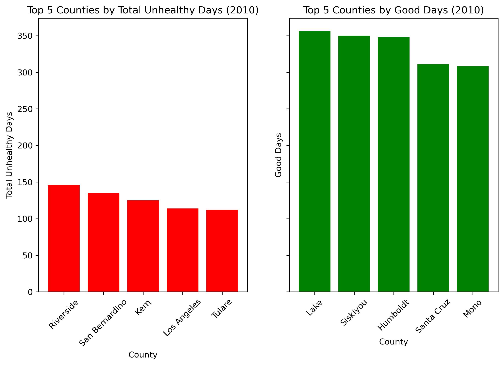

# GreenSpaceAnalysis

## Green Space and Air Quality

### Overview

This project aims to explore the correlation between **green spaces** (e.g., parks, urban forests) and **air quality** over time. By analyzing air quality data, we assess whether an increase in green spaces can contribute to a decrease in air pollution, potentially improving quality of life in urban areas.

### Key Findings:

## Table of Contents
1. [Project Description](#project-description)
2. [Data](#data)
3. [Analysis](#analysis)
4. [Results](#results)
5. [Usage](#usage)
6. [Installation Instructions](#installation-instructions)
7. [Contributing](#contributing)
8. [License](#license)

## Project Description

This project analyzes the relationship between green spaces and air quality across different counties in California, focusing on how the amount of green space impacts the air quality, particularly in terms of **"Total Unhealthy Days"**, a sum of verious type of Unhealthy Days recorded in air quality data. The analysis spans data from 1990 to 2020 in 5-year intervals. We examining both temporal trends and spatial patterns to understand the overall impact of green spaces on air quality.

### Goals:
- Analyze air quality data at the county level for California from 1990 to 2020.
- Explore spatial patterns of air quality in relation to green spaces.
- Investigate trends in the number of unhealthy air quality days over time.
- Produce insights into the benefits of green spaces in urban planning and environmental policy.

## Data

The primary data sources for this project are:
- **Air quality data** for California counties (1990-2020) that includes daily air quality measurements.
- **Geospatial data** for green spaces in California counties

## Analysis
We first plot CA-wide air quality averages over the temporal span of our data.    
    
We focus on the number of Total Unhealthy Days for our analysis. In the time series plot we see a mininmum of 25 in the  average number of Total Unhealthy days in 2010 and 2015, while the maximum is about 50 Total Unhealthy Days from 1990, 1995 and 2000. In the most current data set for 2020, we see that unhealthy days have increased from the minimum in 2020 although have not increased past the maximum from earlier data sets.     
In the following bar chart, we plot the average number of Total Unhealthy Days for the temporal data span of 1990 - 2020 per California county.    

 

Next, we identify the California counties with the best and worst air quality in each data set.    
    

   

   
 
   

   
   
   
   

From these bar plots we identify the worst counties in terms air quality to be Southern California counties with Riverside, San Bernardino, Los Angeles and Kern all which are adjacent counties appearing in every data set. San Diego county makes it to this list only in 1990 ... has this county since adopted green initiaves such as preserving protected areas or prioritizing green urban planning? What is the percentage of green space in San Diego in 1990 vs 2020?    

On the other hand, the best counties in terms of air quality are mainly Northern California counties with Lake making the list for every data set. What is the percentage of green space in Lake county and what are this county's initiatives in terms of green spaces?   
Some more central counties making the top 5 are Santa Cruz and San Benito.   

Below map the air quality data in terms of Total Unhealthy Days per county for the years 1990, 2000, 2010, 2020.    

#### 1990
   

#### 2000
 

#### 2010
  

#### 2020
   

Focusing on 2020 data, we also map green spaces for the worst five air quality counties as well as the percentage of green space.    

   
   

From the green space percentage map we see that Tulare has high percentage of green space, however this county makes the list for worst air quality in four of the data sets. What are potential causes of bad air quality in Tulare county e.g. does it have high industrial acivity?

